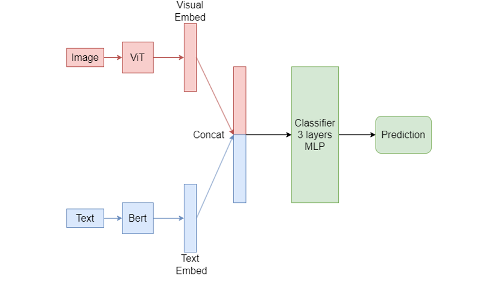
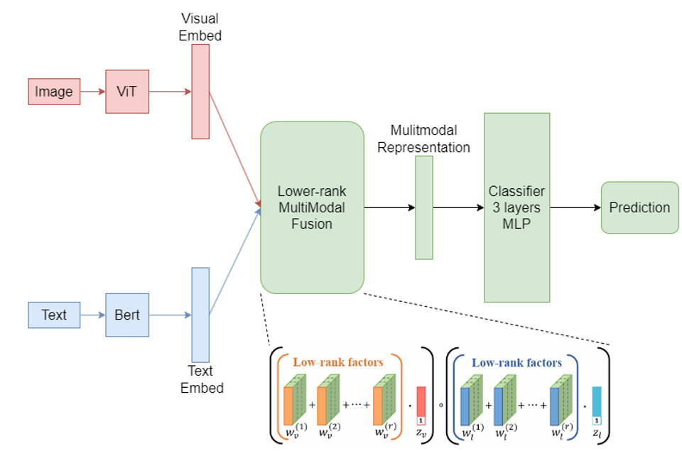
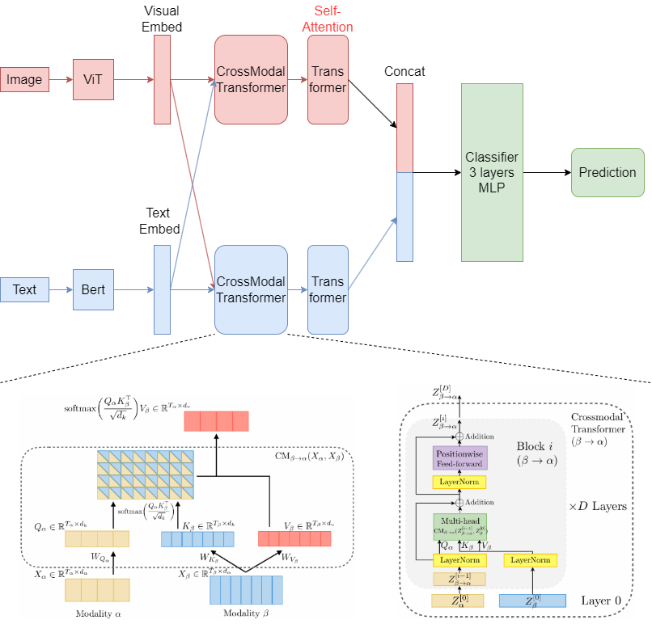
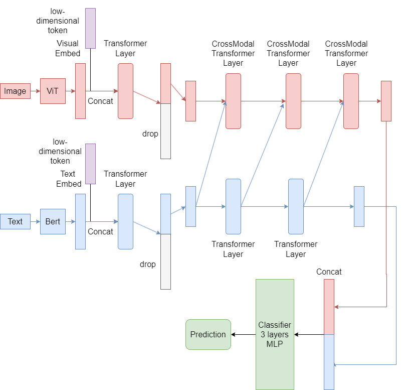

# 实验五：多模态情感分析

姓名：吴冕志

学号：10215501411

GitHub仓库地址：(https://github.com/Hdksg10/dase-ai-msa)

## 概述

### 配置

代码基于Python3实现，我们需要首先安装下面的依赖库:

- transformers==4.37.1
- torch==2.1.0
- pandas==2.0.3
- scikit-learn==1.3.1
- tqdm==4.66.1
- Pillow==10.0.1
- numpy==1.24.4

```
pip install -r requirements.txt
```
我们还需要将使用的数据集解压到/datasets目录下，即
```
|-- datasets
    |-- data/
    |-- test_without_label.txt
    |-- train.txt
|-- multimodal
|-- run_train_model.py
...
```
如果数据集位于别的位置，我们需要在`run_trian_model.py`中更改传递给`TrainDataset, TestDataset`的数据集路径。

### 文件结构

```
|-- multimodals # 模型实现代码
  |-- ALMT.py/ # ALMT[1]的实现
  |-- base.py/  # 多模态模型的基本实现，朴素连接
  |-- LMF.py/  # Low-rank Multimodal Fusion[2]的实现
  |-- MULT.py # Multimodal Transformer[3]的实现
  |-- processor.py # huggingface格式的多模态数据预处理器，包括BERT分词器和ViT的图像预处理器 
  |-- sadatasets.py # 数据集的读取等操作
  |-- TransformerEncoder.py # 基于PyTorch的CrossModal Transformer和Transformer的实现（用于MULT和ALMT）
  |-- utils.py # 一些工具方法，包括训练，评估和预测  
|-- results # 所有实验结果
|-- predict.txt # 在测试集test_without_label.txt上的标签预测结果
|-- readme.md # 本文件
|-- requirements.txt # 依赖
|-- run_train_model.py # 运行模型代码的主文件
|-- train.sh # 训练用脚本
```

### 运行代码

你可以通过运行`run_train_model.py`来训练并在验证集上验证模型
```
 python run_train_model.py
```

具体的参数为
```
usage: run_train_model.py [-h] [--model MODEL] [--epochs EPOCHS] [--batch_size BATCH_SIZE] [--lr LR]
                          [--eval_per_epoch] [--modals MODALS] [--predict]

optional arguments:
  -h, --help            show this help message and exit
  --model MODEL         model to run, default almt, almt for ALMT, lmf for LMF, mult for MULT, base for base
                        model(naive concat)
  --epochs EPOCHS       number of epochs to train, default 10
  --batch_size BATCH_SIZE
                        batch size for training, default 32
  --lr LR               learning rate, default 1e-4
  --eval_per_epoch      whether to evaluate on validation dataset per epoch
  --modals MODALS       modals to use, default ti, ti for text and image, i for image only, t for text only
  --predict             whether to predict on test dataset
  --predict_path PREDICT_PATH
                        path to save predict result
```

例如，我想采用5e-4的学习率，16的batch size来训练文本和视觉两个模态的MULT模型，训练epoch数为5，并在每个epoch后在验证集上计算评估指标，同时在测试集上预测标签，并保存到`predict_mult.txt`中，可以运行下面的指令：
```
python run_train_model.py --model mult --lr 5e-4 --batch_size 16 --epochs 5 --eval_per_epoch --modals ti --predict --predict_path "predict_mult.txt"
```

## 实现中遇到的BUG

在实验中，我遇到了随着epoch的增加，训练过程中的loss一直下降，但在验证集上的诸指标（例如准确率）一直保持不变的问题。并且该问题一开始并没有出现，而是在我手动设置随机数种子后才出现，而之前训练的模型又能得到合理的验证集指标。这个问题困扰了我一段时间，后来，我注意到问题产生的原因是在实现模型的分类器（输出头）时，不小心在最后一个线性层的输出上应用了ReLU激活函数，即

```
        self.classifier = nn.Sequential(
            nn.Dropout(config.drop_out),
            nn.Linear(config.hiden_dim, config.hiden_dim),
            nn.ReLU(),
            nn.Dropout(config.drop_out),
            nn.Linear(config.hiden_dim, config.hiden_dim),
            nn.ReLU(),
            nn.Dropout(config.drop_out),
            nn.Linear(config.hiden_dim, config.num_labels),
            nn.ReLU()
        )
```

由于ReLU激活函数会使得所有负值变为0，因此在特定情况下，如果线性层的输出全为负，就会产生错误的预测结果。

去掉最后一个ReLU激活函数就能解决这个问题。

## 模型设计

我设计多模态模型的基本思想与常见的设计思想一致，即分别采用在许多下游任务上实现SOTA的backbone模型来获取图像和文本数据的embedding表示，随后将二者进行融合，并通过一个简单的MLP作为分类器来预测样本的情感标签。

我采用的backbone模型分别为ViT（视觉）和BERT（文本）。

### 朴素连接

自然的想法是直接将两个embedding表示直接进行张量的连接，随后将连接后的张量送入分类器得到预测结果。



### LMF

但是朴素连接的方法存在一个显著的缺点，直接对张量进行连接意味着模型很少考虑不同模态之间的相关性等信息，所以我又实现了经典的LMF(Low-rank Multimodal Fusion)[2]策略来尝试解决这个问题。



不过实际实现中，LMF方法的表现不是很好，甚至不如朴素连接的结果。

### 基于注意力的方法：MULT



为了更好的捕捉模态之间的相关性，我在特征融合的过程中采用了注意力机制。参考Multimodal Transformer[3]的结构，我实现了处理不同模态信息的Cross Modal Transformer，简单来说，我们将一个模态的embedding 作为attention中的query，另一个模态的embedding作为key和value（在原本的Transformer中，query, key, value是一致的，即自注意力），从而得到综合其它模态信息之后的信息。

### 文本模态的主导作用：ALMT

在上面所有的模型中，我们都没有将不同模态的特征区分开来，而是认为它们是同等重要的，但实际上我们的数据集中，很多情况下文本信息比视觉信息更能表现样本对应的情感，所以受到[1]中AHL层的启发，我用文本特征来指导捕捉视觉特征，在具体实现中，下图中的Cross Modal Transformer Layer中，文本特征作为query，图像特征作为key和value进行注意力计算，得到新的修正后的图像特征。



我也参考了[1]中的trick：在进行不同模态的融合前，连接一个token，并通过Transformer将embedding中的信息学习到token中，达到降维的效果。

总的来说，我认为我的模型具有下面的优点：

- 基于目前被广泛使用的，在很多下游任务上实现SOTA的预训练模型BERT, ViT作为backbone进行实现。
- 采用Transformer结构综合考虑不同模态特征之间的相关关系与模态内部的信息。
- 考虑到不同模态特征之间的不平等问题，用文本模态来指导视觉模态的信息获取。

## 实验结果

在验证集上分别计算了预测的准确率与相应的消融实验，对应的结果如下

|                  | Acc-3      | MAE         | F1 Score   |
| ---------------- | ---------- | ----------- | ---------- |
| **Naive Concat** | 0.72625    | **0.43375** | 0.72625    |
| w/o Image        | 0.63625    | 0.605       | 0.63625    |
| w/o Text         | 0.665      | 0.57125     | 0.665      |
| **LMF**          | 0.69125    | 0.52875     | 0.69125    |
| w/o Image        | 0.48125    | 0.79875     | 0.48125    |
| w/o Text         | 0.675      | 0.5575      | 0.675      |
| **MULT**         | 0.72375    | 0.45        | 0.7162     |
| w/o Image        | 0.65875    | 0.55875     | 0.65875    |
| w/o Text         | 0.62375    | 0.62        | 0.6225     |
| **ALMT**         | **0.7325** | 0.455       | **0.7325** |
| w/o Image        | 0.68125    | 0.53375     | 0.68125    |
| w/o Text         | 0.655      | 0.58125     | 0.655      |

在消融实验中，我们通过对其中一个模态输入空字符串或空白图片，达到只考虑一个模态信息的情况。

## Reference

[1] H. Zhang, Y. Wang, G. Yin, K. Liu, Y. Liu, and T. Yu, "Learning Language-guided Adaptive Hyper-modality Representation for Multimodal Sentiment Analysis," *arXiv preprint arXiv:2310.05804*, 2023.

[2] Z. Liu, Y. Shen, V. B. Lakshminarasimhan, P. P. Liang, A. Zadeh, and L.-P. Morency, "Efficient low-rank multimodal fusion with modality-specific factors," *arXiv preprint arXiv:1806.00064*, 2018.

[3] Y.-H. H. Tsai, S. Bai, P. P. Liang, J. Z. Kolter, L.-P. Morency, and R. Salakhutdinov, "Multimodal Transformer for Unaligned Multimodal Language Sequences," in *Proceedings of the Conference. Association for Computational Linguistics. Meeting*, vol. 2019, pp. 6558, NIH Public Access, 2019.
